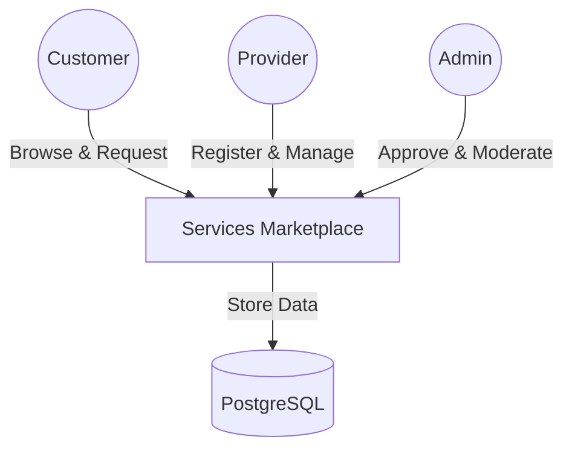
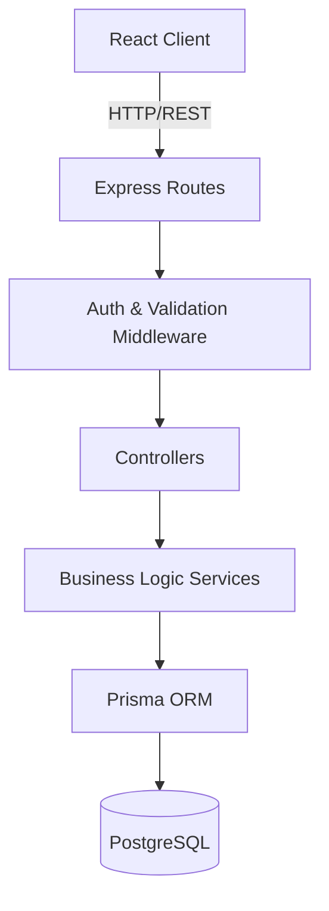

# Services Marketplace Platform (WIP)

A bilingual web platform connecting service providers (plumbers, electricians, locksmiths) with customers who need their services, featuring admin-approved provider registrations, rich provider profiles, in-app messaging, and a commission-based business model.

## Software Architecture

The Services Marketplace Platform (SMP) follows a **Monorepo** structure, housing both the frontend and backend in a single repository for simplified dependency management and shared context.

### Architectural Style: Layered Monolith

The system is designed as a **Layered Monolith**. This choice balances development speed with structural clarity, allowing for a clean separation of concerns without the operational complexity of microservices.

- **Frontend (Client):** A Single Page Application (SPA) built with React and TypeScript, focused on providing a responsive, bilingual user experience.
- **Backend (Server):** A Node.js/Express API that manages business logic, authentication, and data persistence.
- **Database:** A relational PostgreSQL database managed via Prisma ORM to ensure data integrity and type safety.

### Why this Architecture?

1.  **Simplicity & Speed:** For the current scale, a monolith allows for faster iterations, easier testing (E2E flows), and straightforward deployment.
2.  **Type Safety:** Using TypeScript across the entire stack (React + Node.js + Prisma) minimizes runtime errors and improves developer productivity.
3.  **Scalability:** The layered approach (Routes -> Controllers -> Services -> Prisma) makes it easy to split specific domains into microservices in the future if needed.
4.  **Consistency:** A single repository ensures that API changes and frontend updates stay in sync.

### Diagrams (C4 Model)

#### 1. System Context Diagram
Describes how users interact with the platform.



#### 2. Component Diagram (Backend)
Describes the internal layers of the Server.



## Tech Stack

- **Frontend:** React 19, TypeScript, **Vite 6** (Build Tool & Dev Server), Tailwind CSS, i18next (Bilingual), React Router 7.
- **Backend:** Node.js 24, Express, TypeScript, Prisma ORM, JWT.
- **Database:** PostgreSQL 14 (Dockerized).
- **DevOps:** Docker, Docker Compose.

## Project Structure & Components

The project is divided into two main services, coordinated via Docker Compose.

### 🎨 Client (Frontend) - Powered by Vite 6
Located in `/client`. It uses **Vite** for optimized building and extremely fast development (HMR).

#### Key Components:
- **`src/context/AuthContext.tsx`**: Manages the global authentication state, token persistence, and user sessions.
- **`src/api/axios.ts`**: Configured Axios instance for API communication with automatic credential handling.
- **`src/data/colombia.ts`**: Static data provider for Colombian departments and cities used in location selectors.
- **`src/pages/`**:
    - `Register.tsx`: User onboarding flow (Customer vs. Provider).
    - `CompleteProfile.tsx`: Dynamic form for providers featuring Colombian location logic and category selection.
    - `Login.tsx`: Secure entry point to the platform.
    - `AdminDashboard.tsx`: Administrative interface for provider moderation.

### ⚙️ Server (Backend) - Layered Architecture
Located in `/server`. Follows a clean separation of concerns.

#### Core Layers:
- **Controllers**: Handle HTTP requests and response formatting (e.g., `provider.controller.ts`).
- **Services**: Contain the core business logic and rules (e.g., `auth.service.ts`).
- **Validators (Zod)**: Strict input validation and sanitization for all endpoints.
- **Prisma Schema**: The single source of truth for the database structure.

## Current Maturity Level
Contrary to initial planning focusing only on the backend, the project has evolved into a **Full-Stack Functional Prototype**.
- **Frontend:** Fully responsive, integrated with the API, and featuring complex business logic (Colombian localization, multi-step registration).
- **Backend:** Production-ready authentication, robust data validation, and automated database seeding.

## Quick Start (with Docker - Recommended)

The entire platform can be launched with a single command. Ensure you have Docker and Docker Compose installed.

```bash
# Start all services (Database, Backend, Frontend)
docker-compose up --build -d
```

Once running:
- **Frontend:** http://localhost:5173
- **Backend API:** http://localhost:4000
- **API Docs:** http://localhost:4000/api-docs

### Default Credentials
All users share the password: `Prueba123*`
- **Admin:** `admin@marketplace.com`
- **Provider:** `sebesp@gmail.com`
- **Customer:** `cguzman@gmail.com`

## Manual Development Setup

```bash
# Install dependencies
npm install

# Start development servers (both backend and frontend)
npm run dev
```

## Documentation

- [SPEC.md](plans/0000-services-marketplace/SPEC.md) - Full specification document
- [PLAN.md](plans/0000-services-marketplace/PLAN.md) - Implementation plan

## Important Note before Starting

Before running the project with Docker, you must create a `.env` file in the `server/` directory. You can use the provided example:

```bash
cp server/.env.example server/.env
```

## License

Private - All rights reserved
